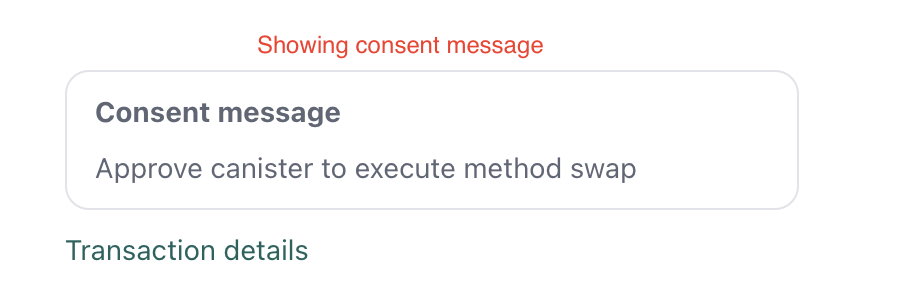
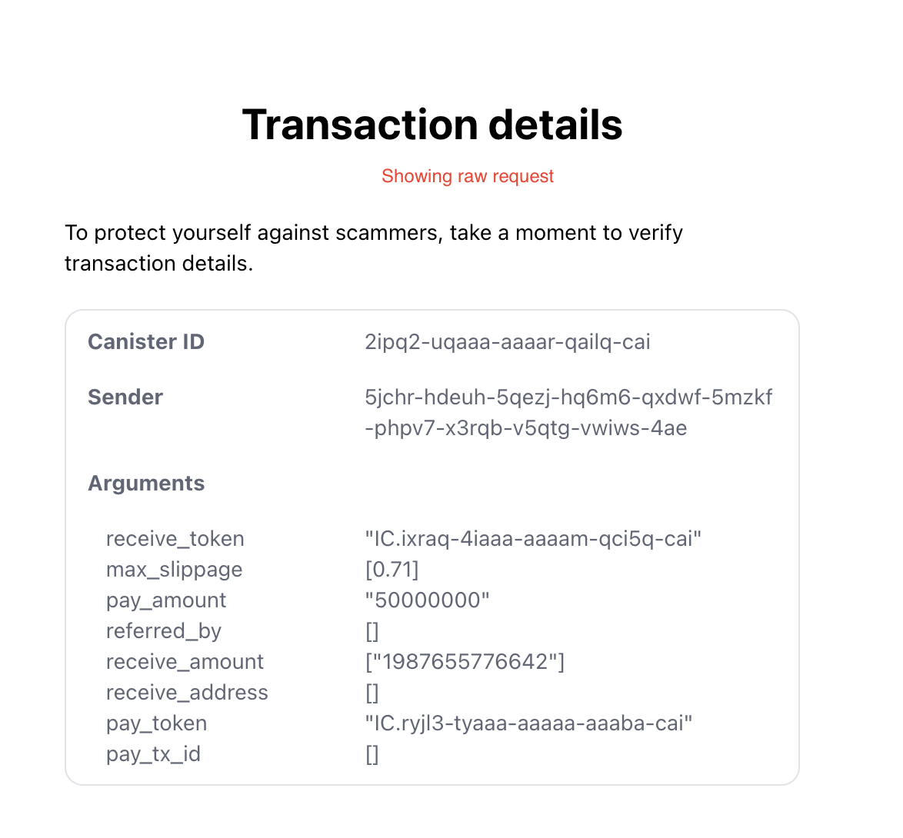

## sequence calls

- Dependencies in request

  - Sea snake recommend combine two mode to one and put `waitFor` in order to want dependencies?
    - Requests without `waitFor` will be executed in parallel
    - Requests with `waitFor` have to wait and parse the response of dependencies to check the response
      - Only ICRC method can be parsed because its candid published
      - Parse flow
        1. Get contentMap (base64 encoded) and certificate to validate
        2. Decode base64
        3. Decode cbor (required Candid or IDL in TS)
        4. Map to js value

- Signer can parse the response of canister call, but what is defined it is a success response?
  - Can relying party define the success response based on regex, Candid type, or exactly response.
  - How Signers can implement the verification in easy way

Example of new ICRCX request

```json
{
  "id": 1,
  "jsonrpc": "2.0",
  "method": "icrcX_batch_call_canisters",
  "params": {
    "sender": "b7gqo-ulk5n-2kpo7-oalt7-p2kyl-o4j5l-kiuwo-eeybr-dab4l-ur6up-pqe",
    "requests": [
      {
        "id": 1,
        "canisterId": "xhy27-fqaaa-aaaao-a2hlq-ca",
        "method": "approve",
        "arg": "RElETARte24AbAKzsNrDA2ithsqDBQFsA/vKAQKi3pTrBgHYo4yoDX0BAwEdV+ztKgq7E4l1ffuTuwEmw8AtYSjlrJ+WLO5ofQIAAMgB"
      },
      {
        "id": 2,
        "canisterId": "xhy27-fqaaa-aaaao-a2hlq-ca",
        "method": "approve",
        "arg": "RElETARte24AbAKzsNrDA2ithsqDBQFsA/vKAQKi3pTrBgHYo4yoDX0BAwEdV+ztKgq7E4l1ffuTuwEmw8AtYSjlrJ+WLO5ofQIAAMgB"
      },
      {
        "id": 3,
        "canisterId": "xhy27-fqaaa-aaaao-a2hlq-ca",
        "method": "swap",
        "arg": "RElETARte24AbAKzsNrDA2ithsqDBQFsA/vKAQKi3pTrBgHYo4yoDX0BAwEdV+ztKgq7E4l1ffuTuwEmw8AtYSjlrJ+WLO5ofQIAAMgB",
        "waitFor": [1, 2]
      },
      {
        "id": 4,
        "canisterId": "xhy27-fqaaa-aaaao-a2hlq-ca",
        "method": "swap",
        "arg": "RElETARte24AbAKzsNrDA2ithsqDBQFsA/vKAQKi3pTrBgHYo4yoDX0BAwEdV+ztKgq7E4l1ffuTuwEmw8AtYSjlrJ+WLO5ofQIAAMgB",
        "waitFor": [3]
      }
    ]
  }
}
```

## consent message

- So should we batch query for consent message?
  - If we do there are two cases
    - 1. If canister supported ICRC21, get the consent message and render it
    - 
    - 2. If canister is not support ICRC21 -> showing the method and payload to call
    - 
  - If not just showing the method and payload to call
- UI should handled by wallet

Example of UI we can use


=> TODO: update the ICRCX to …

## error codes

- Add new error code 1001 as “Not processed due to batch request failure”

## example

- Update example for response
- Update example for error code
